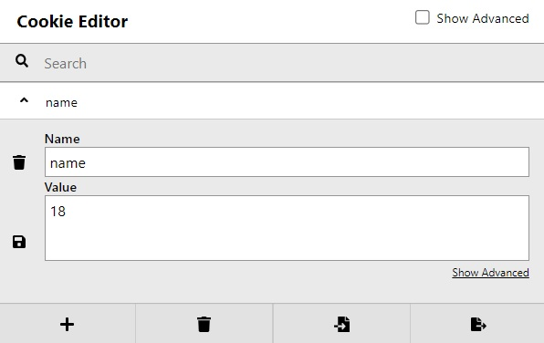

# Cookies

## Description:

[Cookies](http://mercury.picoctf.net:6418/)

## Solution:

* *Khi ta truy cập vào đường link, một giao diện trang web sẽ hiện ra:*

* *Ta nhập thử `snickerdoodle` như trong thanh tìm kiếm, hiện ra như hình dưới và không có gì bất thường xảy ra cả:*

* *Ta mở tool Cookie Editor và kiểm tra cookies, ta thấy có một cookie `name` với `value = 0`*

* *Ta thay đổi `value = 1` rồi reload lại web, ta sẽ thấy có sự thay đổi:*

* *Thử với `value = 2`:*

* *Rồi cứ  tiếp tục thử, cho đến `value = 18` sẽ hiện ra `flag` của bài:*

## Flag:

* `picoCTF{3v3ry1_l0v3s_c00k135_88acab36}`