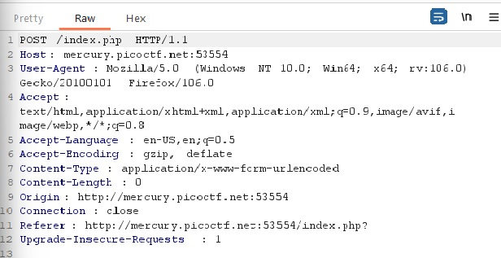

# GET aHEAD

## Description:

[GET aHEAD](http://mercury.picoctf.net:53554/)

## Solution:

* *Khi chúng ta truy cập vào đường link, có 2 lựa chọn để chúng ta chọn: `RED` và `BLUE`:*

* *Mở Burpsuite và bắt request:*

> Ta có thể thấy, button `Choose Red` sẽ có HTTP request `GET method`:

> Còn button `Choose Blue` sẽ có request `POST method`:

* *Ta chuyển 1 trong 2 request sang Repeater rồi đổi HTTP sang `HEAD method` rồi gửi request, response trả về sẽ là `flag` của bài:*

## Flag:

* `picoCTF{r3j3ct_th3_du4l1ty_2e5ba39f}`

