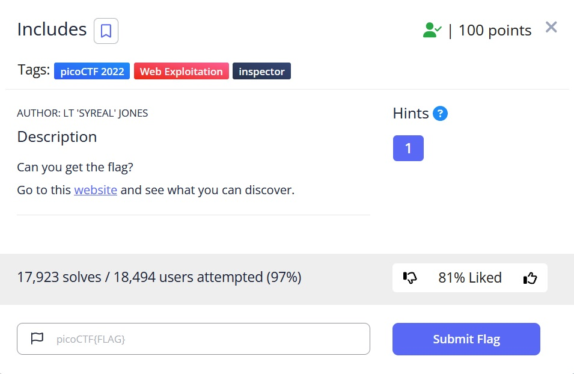
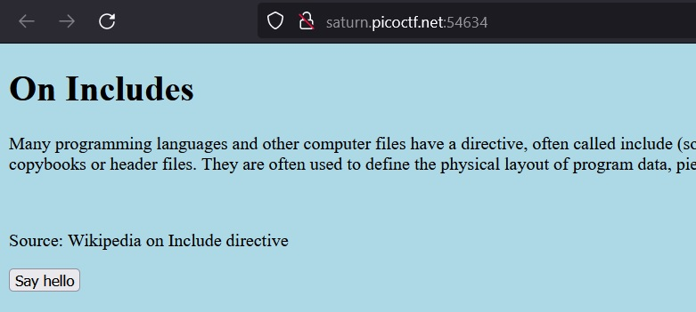
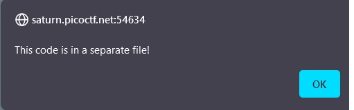
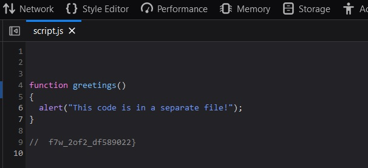
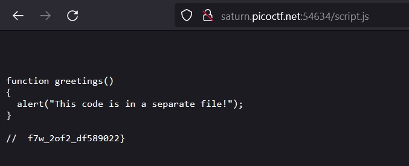

# Includes

## Description:

[Includes](http://saturn.picoctf.net:54634/)

## Solution:

* *Sau khi truy cập đường link, một giao diện web sẽ xuất hiện:*

* *Sau khi ấn `Say hello`, sẽ hiện ra một js như hình dưới:*

* *Ta `Inspect` trang web, không có gì bất thường ở file `index`, không có file `css` và file `js` sẽ xuất hiện một phần flag như hình dưới:*

* *Ta thử truy cập file `js` trên web:*

* *Ta đoán được file css thường để là `style.css`, truy cập vào file, ta có được phần đầu của flag:*

## Flag:

* `picoCTF{1nclu51v17y_1of2_f7w_2of2_df589022}`