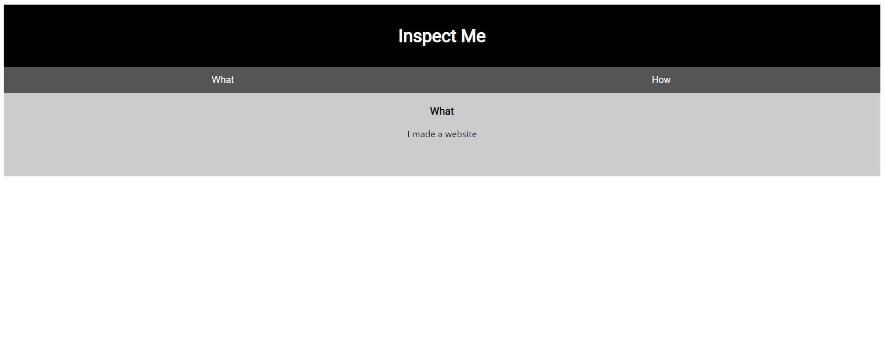

# Insp3ct0r

## Description:

[Insp3ct0r](https://jupiter.challenges.picoctf.org/problem/9670/)

## Solution:

* *Khi ấn vào đường link, ta sẽ thấy được một trang web như bên dưới:*

* *Nhìn vào dòng chữ `Inspect Me` và thói quen mỗi khi vào một trang web, đó là `F12` hoặc chọn `Inspect` để kiểm tra nguồn trang.*

* *Sau khi kiểm tra các thẻ html thì ta có thể thấy được 1 dòng comment như hình dưới, đó là 1/3 của flag:*

* *Nhìn ngay 1/3 và đã có file `html`, ta nghĩ ngay đến kiểm tra source để xem file `css`:*

* *Được 2/3 flag, không lí do gì ta không kiểm tra file `js`, vậy là ta đã có đủ 3 phần của flag:*

## Flag:

* `picoCTF{tru3_d3t3ct1ve_0r_ju5t_lucky?2e7b23e3}`