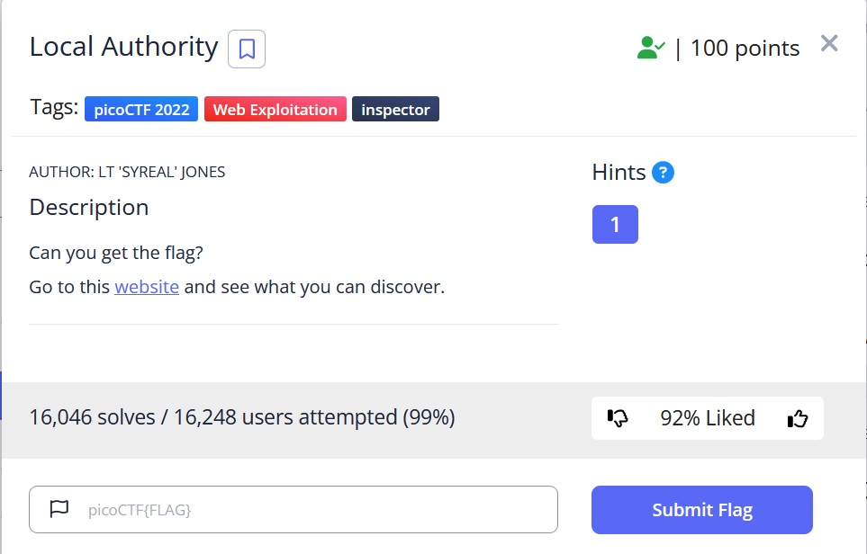
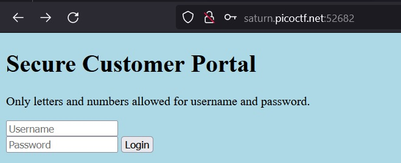
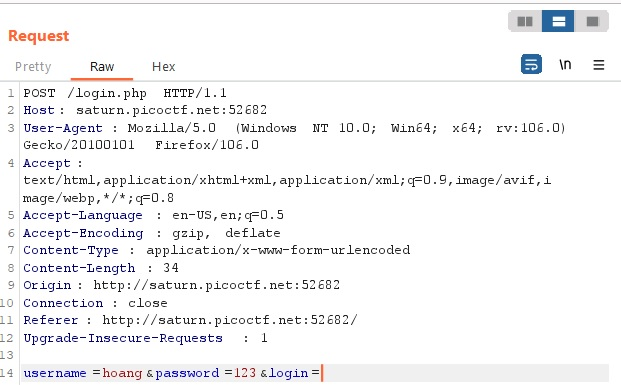
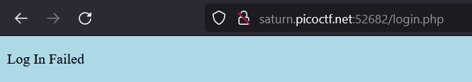
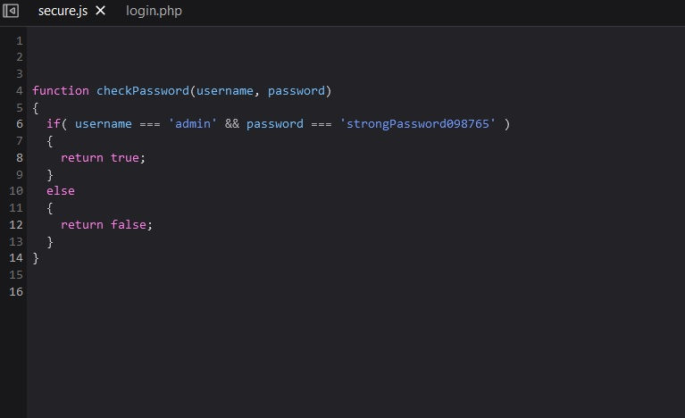
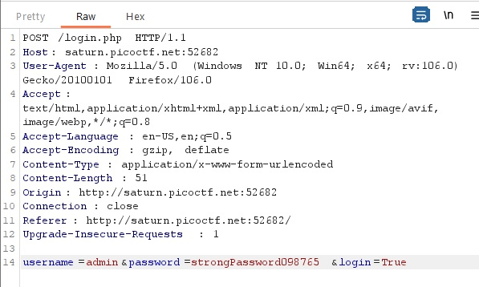
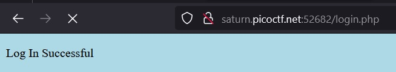
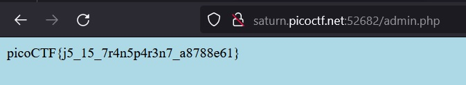

# Local Authority

## Description:

[Local Authority](http://saturn.picoctf.net:52682/)

## Solution:

* *Sau khi truy cập vào đường link, sẽ hiện ra một form đăng nhập như hình dưới:*

* *Khởi động tool `Burp Suite`*

* *Ta nhập một `Username` và một `Password` bất kì rồi dùng `Burp Suite` bắt request:*

* *Ta `Forward` rồi xem kết quả, trang web sẽ Respone về `Log In Failed`, kể cả khi ta đổi value thành `login=True`:*

* *Vẫn ở trang này, ta `Inspect` xem source thì thấy xuất hiện 1 file `secure.js`:*

* *Ta trở về rồi thay đổi request `username=admin` , `password=strongPassword098765` và tất nhiên `login=True`:*

* *Sau khi `Forward`, trang web sẽ trả về `Log In Succesful`:*

* *Và `Forward` tiếp khoảng 2,3 lần thì sẽ ra được file `admin.php` chứ `flag` của bài:*

## Flag:

* `picoCTF{j5_15_7r4n5p4r3n7_a8788e61} `