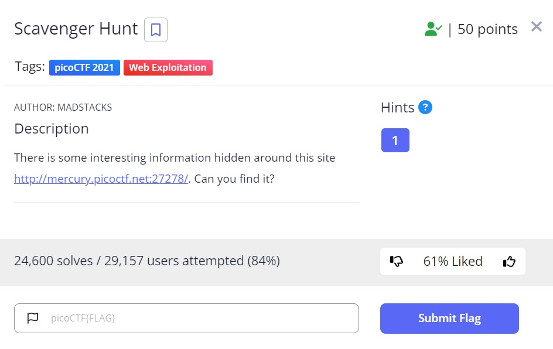
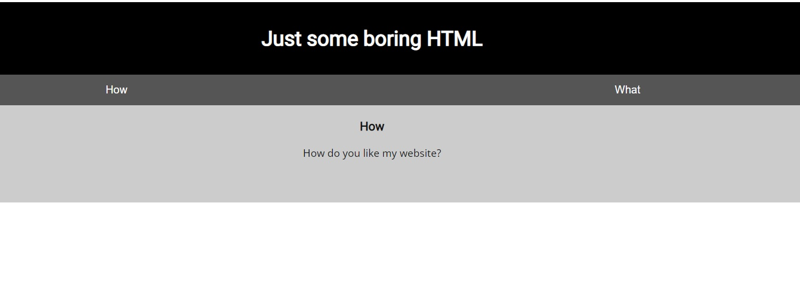
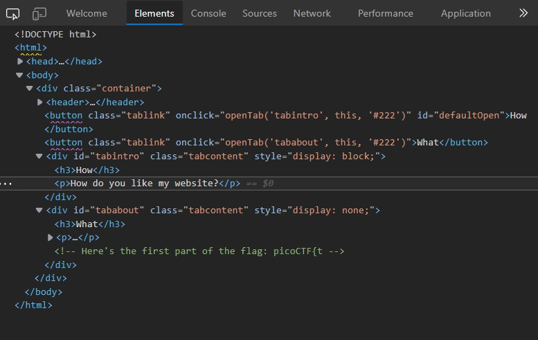
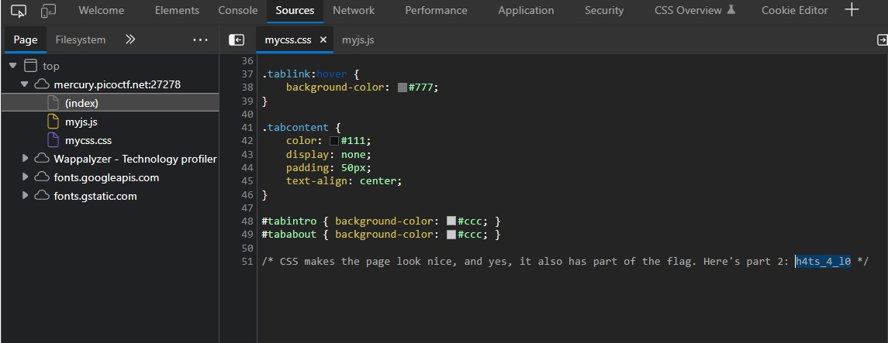
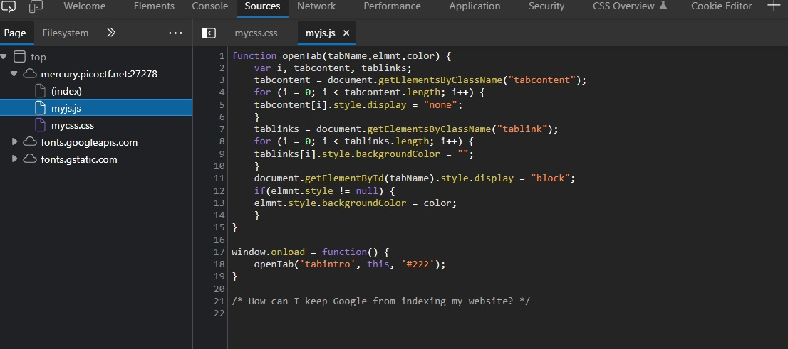
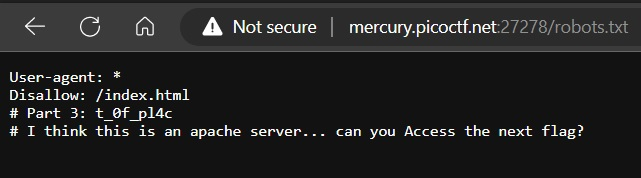
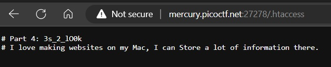
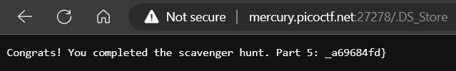

# Scavenger Hunt

## Description:

[Scavenger Hunt](http://mercury.picoctf.net:27278/)

## Solution:

* *Sau khi truy cập vào đường link, sẽ xuất hiện một giao diện web như bên dưới:*

* *Việc điều tiên chúng ta sẽ làm khi truy cập một trang web đó là `Inspect`, chúng ta sẽ lấy được một phần của flag:*

* *Sau đó kiểm tra sang file `css` của trang web, sẽ thấy một phần tiếp theo của flag:*

* *Kiểm tra file `js` của trang web, ta không thấy flag nhưng thấy một dòng chữ: `How can i keep Google from indexing my website?`*

* *Ta nghĩ ngay đến file ẩn `robots.txt`, truy cập vào file đó, ta sẽ có thêm một phần của flag và gợi ý tiếp theo:*

* *Ta thấy gợi ý `I think this is an apache server.. can you Access the next flag?`, tra Google cách truy cập vào 1 file của apache server và để ý nhấn mạnh `Access` nên ta suy đoán ra được file `.htaccess`, truy cập sẽ có một phần flag và gợi ý tiếp theo:*

* *Gợi ý tiếp theo là `I love making websites on my Mac, I can Store a lot of information there`, tra Google và để ý chữ `Store` nhấn mạnh, ta suy đoán đó là file `.DS_Store`, truy cập ta có được một phần flag cuối cùng:*

## Flag:

* `picoCTF{th4ts_4_l0t_0f_pl4c3s_2_lO0k_7a46d25d}`