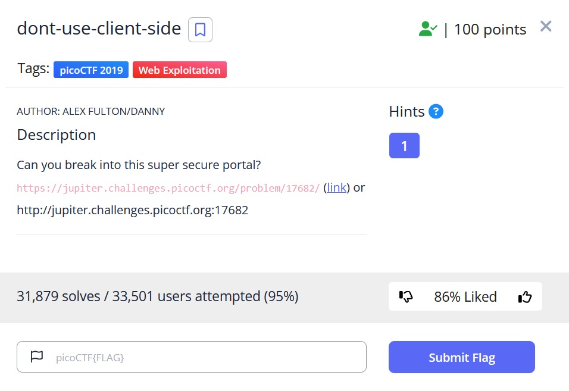
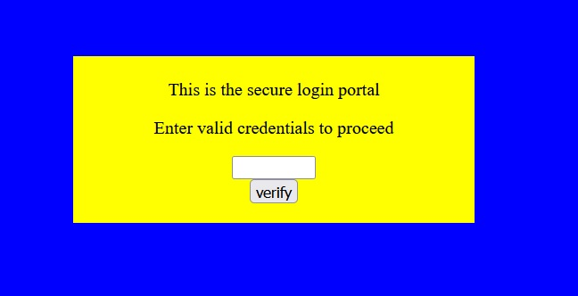
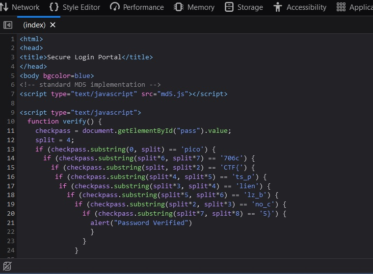

# dont-use-client-side

## Description:

[dont-use-client-side](https://jupiter.challenges.picoctf.org/problem/17682/)

## Solution:

* *Sau khi truy cập vào đường link, ta sẽ thấy một giao diện web như ở hình dưới:*

* *Sau khi `Inspect` trang web, ta có thể thấy một vài dòng script có liên quan đến flag, sau khi ghép nối một chút thì ta có thể ghép được flag =))))))*

## Flag:

* `picoCTF{no_clients_plz_b706c5}`