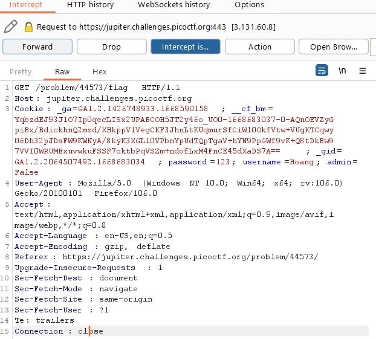

# logon

## Description:

[logon](https://jupiter.challenges.picoctf.org/problem/44573/)

## Solution:

* *Sau khi truy cập vào đường link sẽ hiện ra một giao diện đăng nhập:*

* *Sau khi đăng nhập bằng một `Username` và `Password` bất kì, sẽ hiện ra như bên dưới:*

* *Ta nghĩ ngay đây có thể liên quan đến `Access Control` nên dùng tool `Burpsuite` để kiểm tra request:*

* *Có thể thấy trong request `GET method`, giá trị `admin = False`, ta chỉnh sửa giá trị `admin = True`:*

* *Rồi `Forward`, `flag` sẽ hiện ra:*

## Flag:

* `picoCTF{th3_c0nsp1r4cy_l1v3s_0c98aacc}`

