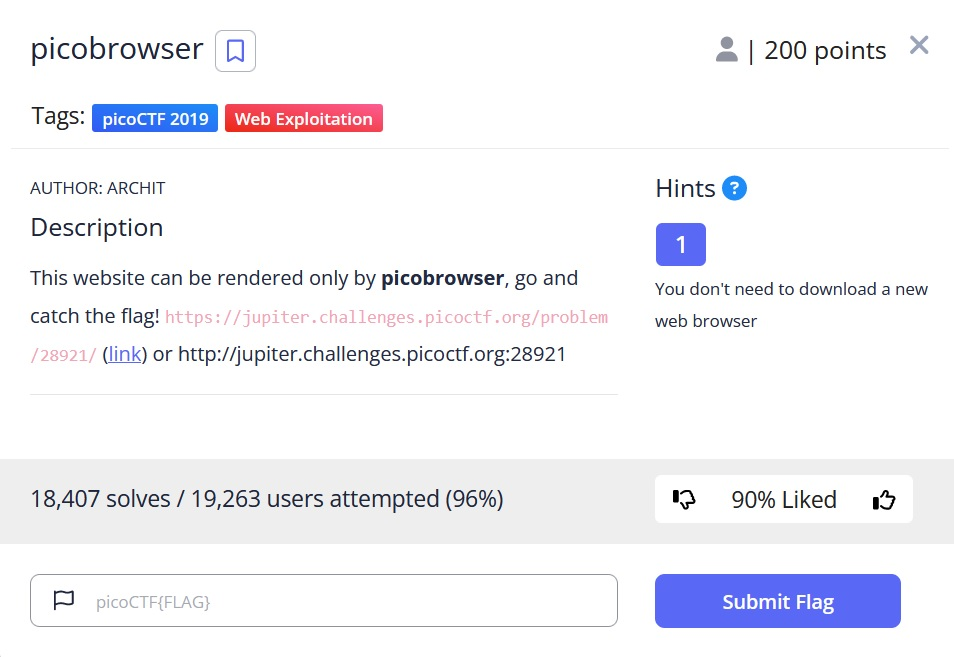
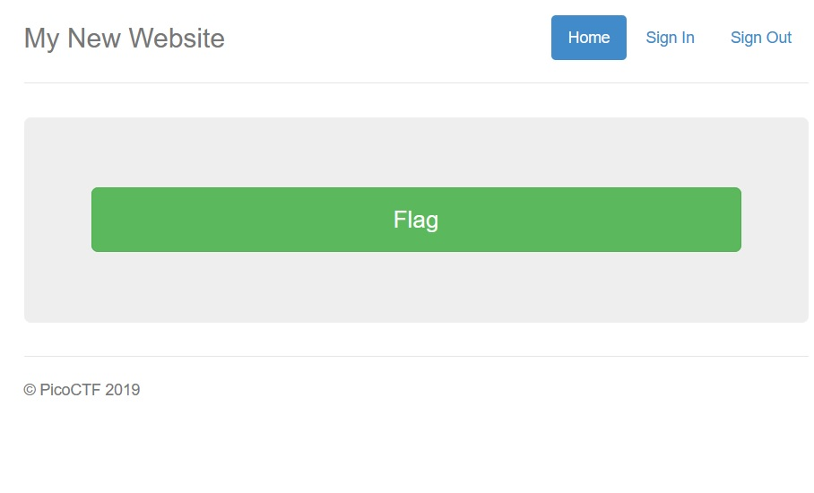
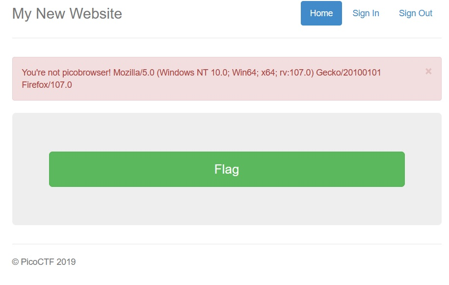
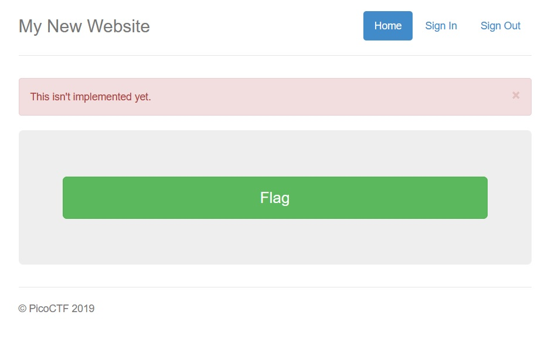
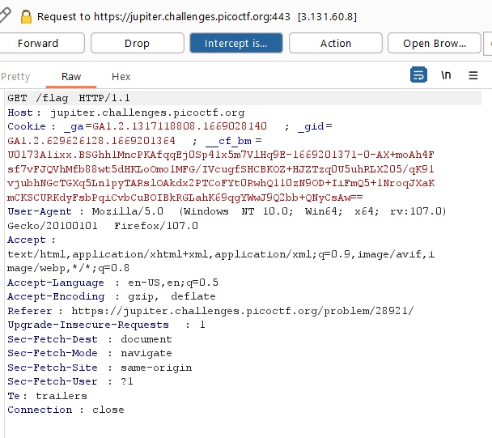
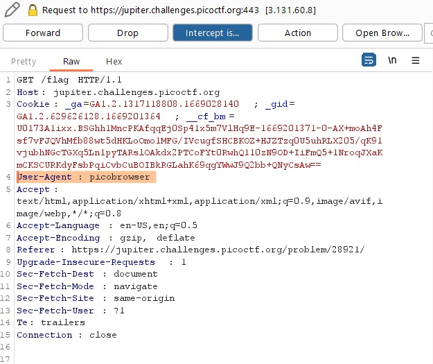
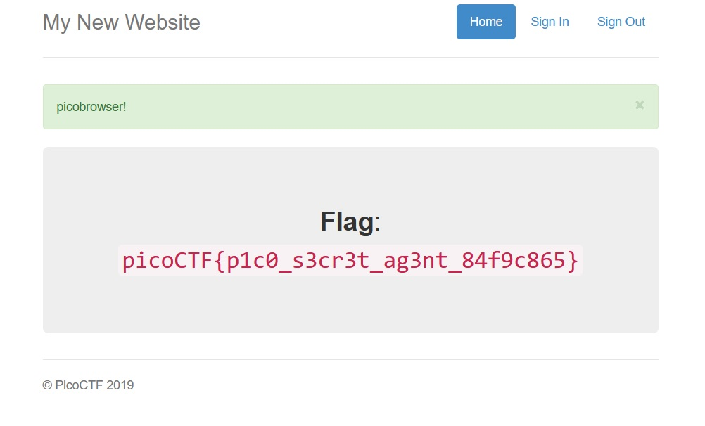

# picobrowser

## Description:

[picobrowser](https://jupiter.challenges.picoctf.org/problem/28921/flag)

## Solution:

* *Sau khi truy cập đường link, một giao diện web sẽ hiện ra:*

* Ta ấn thử nút `Flag` to đùng nhưng tất nhiên sẽ không có flag hiện ra mà thay vào đó là dòng chữ `trình duyệt của bạn không phải là picobrowser`:*

* *Khi truy cập thử mục `Sign In` và `Sign Out` nhưng những mục này không hoạt động:*

* *Khởi động tool `Burp Suite` để bắt request của `Flag`, ta thấy mục User-Agent hiện tại đang là trình duyệt `Firefox`:*

* *Thay đổi request User-Agent : `picobrowser` như đề bài rồi `Forward`:*

* *`Flag` sẽ hiện ra:*

## Flag:

* `picoCTF{p1c0_s3cr3t_ag3nt_84f9c865}`