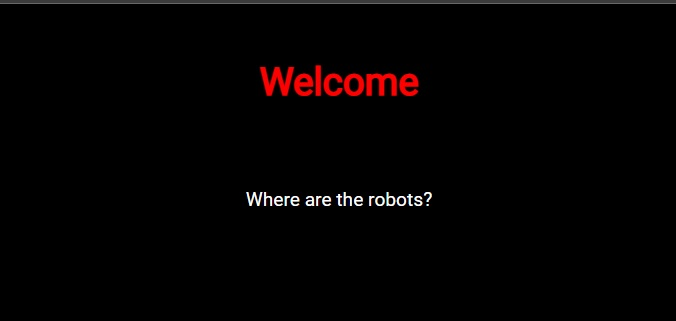

# where-are-the-robots

## Description:

[where are the robots](https://jupiter.challenges.picoctf.org/problem/56830/)

## Solution:

* *Khi truy cập vào đường link, ta sẽ thấy một trang web như hình dưới:*

* *Inspect trang web, kiểm tra các file và source, ta thấy không có gì bất thường*

> Theo tiêu đề và Where are the `robots`, ta nghĩ ngay đến file ẩn robots.txt.

* *Truy cập vào `file robots.txt`, ta có thể thấy được 1 phần Url disallow:*

* *Thêm 1 phần disallow đó vào Url, nó sẽ dẫn ta đến nơi chứa `flag`:*

## Flag:
* `picoCTF{ca1cu1at1ng_Mach1n3s_1bb4c}`

